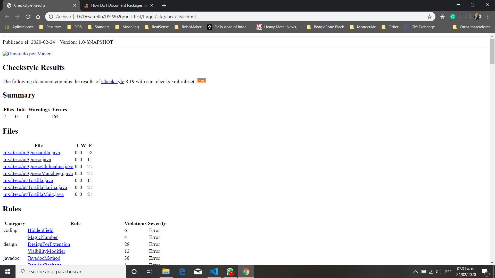
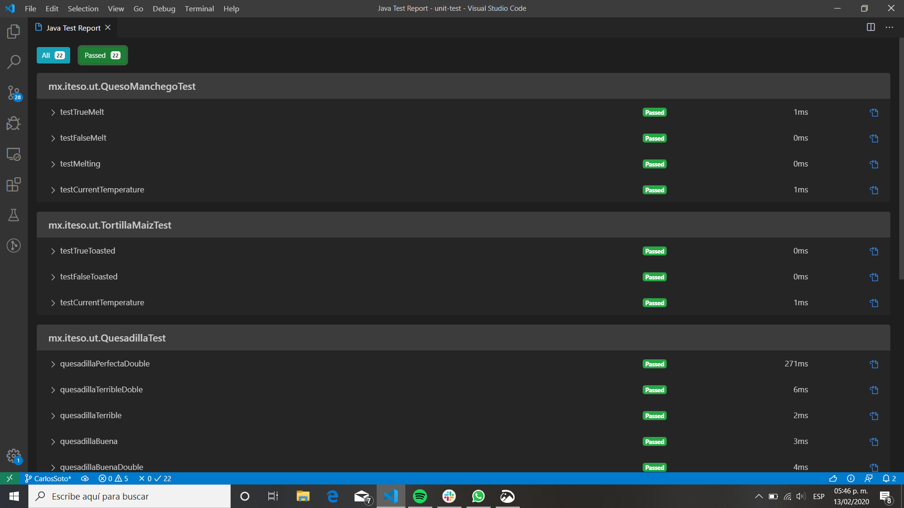

* Run  and understand all unit tests - 1 checkpoint
* Fix/complete unit tests in QuesadillaTest.java class - 2 checkpoint
* Add Unit tests to QuesoManchego, TortillaHarina and TortillaMaiz classes - 2 checkpoints

* Resultados iniciales de checkstyle

* Resultados de las pruebas
